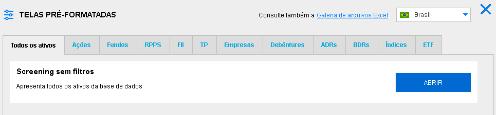

# Introdução ao Economatica

## O que é Economatica?

A Economatica é uma plataforma de análise financeira focada em mercados de capitais, amplamente utilizada por investidores, analistas e profissionais de finanças. Fundada em 1986, a plataforma oferece ferramentas para a avaliação de **ações**, **índices econômicos** e **empresas**, permitindo a análise de dados históricos e projeções. 
Com presença em vários países da América Latina, incluindo Brasil, Argentina e México, a Economática é reconhecida pela precisão e abrangência de suas informações financeiras. A plataforma é uma referência importante para decisões de investimento e análise econômica.

## Acesso ao Economatica

Para acessar o Economatica com o e-mail institucional da UFERSA, basta clicar na **segunda opção** abaixo:	

```{r echo=FALSE}

```

Após isso, a tela de login aparecerá, e basta inserir seu e-mail institucional e entrar no Economatica. É importante ressaltar que o Economatica é uma plataforma paga, e o acesso com o e-mail institucional é possível apenas dentro do domínio da UFERSA.

```{r echo=FALSE}
knitr::include_graphics("acessoB.png")
```

## Principais Funcionalidades

O Economatica possui diversas funcionalidades para auxliar o usuário a obter os dados que precisa em suas análises. 

### Ferramentas de análise

As ferramentas de análise são as janelas que, usando a base de dados e os indicadores, permitem ao usuário efetivamente manipular os dados e chegar a conclusões. Estas são as janelas que mais agregam valor ao sistema Economática e que devem ser mais intensamente exploradas pelos usuários.
Dentre elas, as que iremos utilizar mais serão as ferramentas de `Screening` e `Matrixx`

```{r echo=FALSE}
knitr::include_graphics("ferramentasanalise.png")
```

#### Screening

O screening serve para comparar dados de diferentes ativos, sendo possível escolher quais informações queremos sobre determinado grupo de ativos, como por exemplo, seus dados cadastrais, demonstrativos financeiros e indicadores.

No screening, é possível adicionar filtros para determinar apenas os ativos desejados em nossa pesquisa e organizá-los de acordo com o filtro escolhido.

#### Matrix

O Matrixx no Economatica é uma ferramenta que permite aos usuários criar matrizes personalizadas para analisar e comparar indicadores financeiros de diversas empresas ou ativos simultaneamente. Ele serve para facilitar a visualização e comparação de múltiplos dados em uma única tabela, permitindo uma análise mais eficiente de desempenho, avaliação de múltiplos, e identificação de tendências entre diferentes empresas ou setores. 

No Matrixx, é possível utilizar os dados obtidos no screening e fazer uma evolução temporal dos ativos, após escolher as variáveis de comparação desejadas, é possível definir também os parâmetros, como a data inicial e final da análise, a periodicidade e a moeda.

É especialmente útil para investidores e analistas que precisam comparar grandes volumes de informações de forma rápida e organizada.

### Indicadores

As janelas Indicadores financeiros e Indicadores de mercado mostram valores obtidos a partir de cálculos efetuados com itens da base de dados.

```{r echo=FALSE}
knitr::include_graphics("indicadores.png")
```

### Base de dados

São as janelas que apresentam cada uma das informações que compõem a base de dados do sistema. A aba de base de dados apresenta apenas os dados de um ativo em específico, o chamado ativo corrente.

```{r echo=FALSE}
knitr::include_graphics("basedados.png")
```

# Selecionando a Amostra

primeiro entra no screening aperta em abrir

```{r echo=FALSE}

```

em seguida

```{r echo=FALSE}
knitr::include_graphics("definirparamA.png")
```


## Aplicação de Filtros para Seleção de Empresas e Setores
```{r echo=FALSE}

```

# Coleta de Dados
```{r echo=FALSE}

```

## Seleção de Variáveis
```{r}

```

## Definição do Período de Análise
```{r}

```

## Configuração de Dados em Painel
```{r}

```

## Exportação de Dados
```{r echo=FALSE}
knitr::include_graphics("export.png")
```


