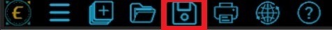
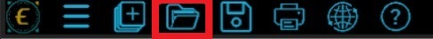

## Prefácio

Este manual visa fornecer a alunos de graduação, noções de como utilizar a base de dados Economatica para realização de pesquisas acadêmicas, trazendo desde aspectos conceituais sobre a plataforma, até uma aplicação prática de sua utilização, por meio de cinco etapas. Focando nas ferramentas de `Screening` e `Matrixx`, para elaboração de uma análise por meio de dados em painel.

# Aspectos conceituais introdutórios do Economatica

## O que é Economatica?

A Economatica é uma plataforma de análise financeira focada em mercados de capitais, amplamente utilizada por investidores, analistas e profissionais de finanças. Fundada em 1986, a plataforma oferece ferramentas para a avaliação de **ações**, **índices econômicos** e **empresas**, permitindo a análise de dados históricos e projeções. 
Com presença em vários países da América Latina, incluindo Brasil, Argentina e México, a Economatica é reconhecida pela precisão e abrangência de suas informações financeiras. A plataforma é uma referência importante para decisões de investimento e análise econômica.

## Acesso ao Economatica

Para acessar o Economatica, primeiramente entre no endereço https://economatica.com. No canto superior direito do cabeçalho, aperte o botão **Login**, destacado em **vermelho**.	

```{r echo=FALSE}

```


Em seguida, clique na **primeira opção** abaixo, "Login Plataforma":	

```{r echo=FALSE}
knitr::include_graphics("acessoA.png")
```


Após isso, uma nova aba com a tela de login aparecerá, e basta inserir seu **e-mail institucional** e entrar no Economatica. É importante ressaltar que o Economatica é uma plataforma paga, e o acesso gratuito por meio do e-mail institucional é possível apenas dentro de um campus da UFERSA.

```{r echo=FALSE}
knitr::include_graphics("acessoB.png")
```


## Principais Funcionalidades

O Economatica possui diversas funcionalidades para auxliar o usuário a obter os dados que precisa em suas análises.

### Ferramentas de análise

As ferramentas de análise são as janelas que, usando a base de dados e os indicadores, permitem ao usuário efetivamente manipular os dados e chegar a conclusões. Estas são as janelas que mais agregam valor ao sistema Economatica e que devem ser mais intensamente exploradas pelos usuários.
Dentre elas, as que iremos utilizar mais serão as ferramentas de `Screening` e `Matrixx`

```{r echo=FALSE}

```


#### Screening

O `Screening` serve para comparar dados de diferentes ativos, sendo possível escolher quais informações queremos sobre determinado grupo de ativos, como por exemplo, seus dados cadastrais, demonstrativos financeiros e indicadores.

No `Screening`, é possível adicionar filtros para determinar apenas os ativos desejados em nossa pesquisa e organizá-los de acordo com o filtro escolhido.

#### Matrixx

O `Matrixx` no Economatica é uma ferramenta que permite aos usuários criar matrizes personalizadas para analisar e comparar indicadores financeiros de diversas empresas ou ativos simultaneamente. Ele serve para facilitar a visualização e comparação de múltiplos dados em uma única tabela, permitindo uma análise mais eficiente de desempenho, avaliação de múltiplos, e identificação de tendências entre diferentes empresas ou setores. 

No `Matrixx`, é possível utilizar os dados obtidos no `Screening` e fazer uma evolução temporal dos ativos, após escolher as variáveis de comparação desejadas, é possível definir também os parâmetros, como a data inicial e final da análise, a periodicidade e a moeda.

É especialmente útil para investidores e analistas que precisam comparar grandes volumes de informações de forma rápida e organizada.

### Indicadores

As janelas Indicadores financeiros e Indicadores de mercado mostram valores obtidos a partir de cálculos efetuados com itens da base de dados.

```{r echo=FALSE}

```


### Base de dados

São as janelas que apresentam cada uma das informações que compõem a base de dados do sistema. A aba de base de dados apresenta apenas os dados de um ativo em específico, o chamado ativo corrente.

```{r echo=FALSE}
knitr::include_graphics("basedados.png")
```


# Etapa 1 - Selecionando a Amostra

Para melhor demonstração das funcionalidades de `Screening` e `Matrixx`, utilizaremos um caso prático: vamos criar uma amostra com as ações da Bovespa, com exceção das financeiras, em um período de análise de 2010 à 2023, onde obteremos seu Ativo Total e seu Patrimônio Líquido (PL).

Ao abrir a plataforma, você verá a seguinte tela inicial. Selecione a opção `Screening`. 

```{r echo=FALSE}
knitr::include_graphics("principaisfunc.png")
```


**Observação**: Caso não esteja vendo essa tela, basta clicar no sinal de mais [+], no canto superior esquerdo, destacado em vermelho:

```{r echo=FALSE}

```


Após selecionar o `Screening`, seguimos então com a escolha dos **Ativos** desejados, onde teremos a seguinte tela:

```{r echo=FALSE}
knitr::include_graphics("screeningA.png")
```


Para nosso caso prático, selecione a opção **Ações**.

```{r echo=FALSE}

```


Após clicar em **Abrir**, veremos esses dados:

```{r echo=FALSE}

```

Agora definiremos os parâmetros da amostra desejada, selecionando a opção **Criar coluna**. É possível selecionar diversas informações sobre as empresas, como seus dados cadastrais, demonstrativos financeiros ou mesmo cotações. No nosso exemplo, iremos obter o país sede e o setor econômico.

Iremos selecionar então Dados Cadastrais → Ações → País Sede, e depois Dados Cadastrais → Ações → Setor Econômico Bovespa.

```{r echo=FALSE}

```

Teremos então a seguinte tela:

```{r echo=FALSE}
knitr::include_graphics("screeningposparam.png")
```

# Etapa 2 - Aplicação de Filtros para Seleção de Empresas e Setores

É possível realizar a aplicação de filtros na amostra, onde obteremos apenas os dados desejados e apenas das empresas que são necessárias para a análise.

```{r echo=FALSE}
knitr::include_graphics("screeningC.png")
```


Para inserir os filtros, basta selecionar o ícone de **filtro** no canto superior direito, destacado em **azul**.
Após isso, o seguinte menu será aberto:

```{r echo=FALSE}
knitr::include_graphics("filtrosA.png")
```


Existem diversas possibilidades de filtros, de acordo com as colunas criadas anteriormente. Como nossa análise busca empresas não financeiras, no nosso filtro do Setor Econômco Bovespa, marcaremos a opção Diferente → Financeiro. No país sede, escolhemos Igual → Brasil. No Ativo/Cancelado, alteraremos para "não é nulo".

Perceba que quando queremos *excluir* determinado tipo de dado, filtraremos por "diferente de", e quando desejarmos *incluir* os dados, selecionamos a opção "igual a".

Existe ainda uma terceira opção, "não é nulo", onde *qualquer tipo de dado* será apresentado. Esta opção é particularmente útil no filtro Ativo/Cancelado, que retorna se determinado ativo, ação ou empresa ainda está em atividade. Em determinados tipos de análise, como a nossa, são necessários os dados de ativos descontinuados. Um exemplo seria analisar níveis de solvência de determinado setor: se excluíssemos os dados das empresas canceladas, perderíamos dados substanciais para a correta análise da amostra.

Ainda é importante destacar que para maior facilidade da análise, é recomendado marcar a opção *mostrar apenas uma classe por empresa,* onde teremos apenas um tipo de ação para cada entidade. Com isso, selecione *OK*. 
Contudo, Se a sua pesquisa depende de variáveis econômico-financeiras que variam dependendo do Tipo de Ação, ou seja, *Preferenciais, Ordinárias ou Units*, esta opção pode prejudicar a robustez das informações, portanto, recomenda-se não marcar a opção. Caso contrário, marcar a opção *mostrar apenas uma classe por empresa* vai diminuir redundâncias na base de dados.

```{r echo=FALSE}

```


Também cabe ressaltar que é possível aplicar filtros baseados em colunas específicas. Ao clicar com o botão direito do mouse em cima de uma das colunas do `Screening`, a seguinte seleção será mostrada:

```{r echo=FALSE}

```


Basta selecionar a opção "inserir filtro baseado nesta coluna". 
Também é possível organizar toda a seleção de acordo com o filtro selecionado. Por padrão, o Economatica trás as empresas em ordem alfabética, mas é possível filtrar para que a ordem se estabeleça de acordo com o filtro e coluna desejados.

# Etapa 3 - Seleção de Variáveis

Após a aplicação dos filtros, veremos o `screening`, similar ao apresentado abaixo:

```{r echo=FALSE}
knitr::include_graphics("screeningC.png")
```


Depois disso, podemos prosseguir para a elaboração do `Matrixx`, onde escolheremos o item do `Matrixx` pelo ativo corrente. 
Primeiro iremos voltar para a tela onde anteriormente selecionamos o `Screening`, e  dessa vez selecionamos `Matrixx`.

```{r echo=FALSE}

```

Para elaborar o `Matrixx`, devemos definir os parâmetros desejados. Assim como no `Screening`, para definir os parâmetros, clicamos em **Criar coluna**. No nosso exemplo, queremos o Ativo Total e o PL das entidades. 

Para definir os parâmetros, primeiramente vamos escolher as informações desejadas: Demonstrativos financeiros → Principais Itens → Ativo Total e depois Patrimônio Líquido.

```{r echo=FALSE}
knitr::include_graphics("definirparamdf.png")
```


Posteriormente, a tela a seguir será exibida. Basta manter o Ativo associado à coluna como "Corrente" e clicar em OK.

```{r echo=FALSE}

```


Depois da definição dos parâmetros iniciais, selecionamos os três traços no canto superior direito, marcado em **amarelo**.

```{r echo=FALSE}
knitr::include_graphics("matrixxinicial.png")
```


Após isso, selecionamos a opção "Vários parâmetros".

```{r echo=FALSE}

```


Aqui vemos a tela de **Vários Parâmetros**, onde definiremos o horizonte temporal da amostra: sua periodicidade, data de início e de fim da coleta. Também definiremos a moeda desejada para a análise, no nosso caso, o Real. Você pode marcar qualquer uma das opções em *mostrar no cabeçalho da coluna*, isso não influenciará a amostra.

```{r echo=FALSE}
knitr::include_graphics("parametros.png")
```


Nossa análise se estende do dia 1° de janeiro de 2010 até 31 de dezembro de 2023, com periodicidade anual. 

# Etapa 4 - Coleta dos dados e estruturação de dados em painel

Concluídas todas as definições de parâmetros, teremos nosso `Matrixx`, onde é possível dividir a tela com o `Screening`, e ao selecionar a empresa no `Screening`, seus dados serão apresentados no `Matrixx`. Para mostrar a tela dividida entre `Screening` e `Matrixx`, devemos clicar nos três traços do canto superior esquerdo, destacado em vermelho.

```{r echo=FALSE}
knitr::include_graphics("matrixxposparam.png")
```


O seguinte menu será aberto:

```{r echo=FALSE}

```


Escolhemos a opção "Lado a lado horizontal (Shift + F4)" e teremos a seguinte formatação:

```{r echo=FALSE}

```


Repare que, ao clicar em outra empresa no `Screening`, os dados no `Matrixx` mudam de acordo com a empresa correspondente.

Finalizada a coleta, é possível *salvar* os dados para acessar a qualquer momento. Para salvar os dados da coleta, basta clicar no ícone de disquete:

```{r echo=FALSE}

```

Após isso, basta renomear o arquivo como o usuário desejar e apertar em salvar.

```{r echo=FALSE}

```

E para abrir uma tela salva anteriormente, utilizamos a ferramenta com ícone de pasta, conforme mostrado abaixo:

```{r echo=FALSE}

```

Finalmente, é só pesquisar o arquivo e clicar em abrir.

```{r echo=FALSE}

```

# Etapa 5 - Exportação de Dados

Por fim, podemos *exportar* os dados coletados para realizar a análise em outros softwares mais especializados, proporcionando uma análise mais aprofundada. Para realizar a exportação, selecionamos a opção destacada em vermelho, no canto superior direito.

```{r echo=FALSE}

```


Logo após, selecionamos a opção exportar.

```{r echo=FALSE}

```


Por fim, selecionamos as opções de exportação.

```{r echo=FALSE}

```


Podemos exportar em vários formatos de arquivo, como CSV, XLSX, PDF, entre outros. No nosso caso, vamos exportar em CSV, conforme mostrado abaixo. Podemos escolher o nome do arquvo para salvar ou enviá-lo para um e-mail selecionado. 

Finalmente, na parte de imprimir os dados desta janela, optamos pela opção "Para todos os arquivos da janela de screening" e salvamos todos em um arquivo único.

```{r echo=FALSE}

```


Seus dados estarão dispostos na estrutura de dados em painel no Excel ou em outra ferramenta de planilhas ou análise de dados.

```{r echo=FALSE}

```


E este é o fim do tutorial. Esperamos que ele sirva de base para a realização de seu trabalho. Importante frisar que este tutoral buscou utilizar exemplos práticos para melhor entendimento, cabendo salientar que o usuário pode escolher os dados que são mais relevantes para a sua pesquisa, não estando limitados ao que foi apresentado.

Autores:

Marcos Thiago Martins

Matheus Juan Silva Ribeiro