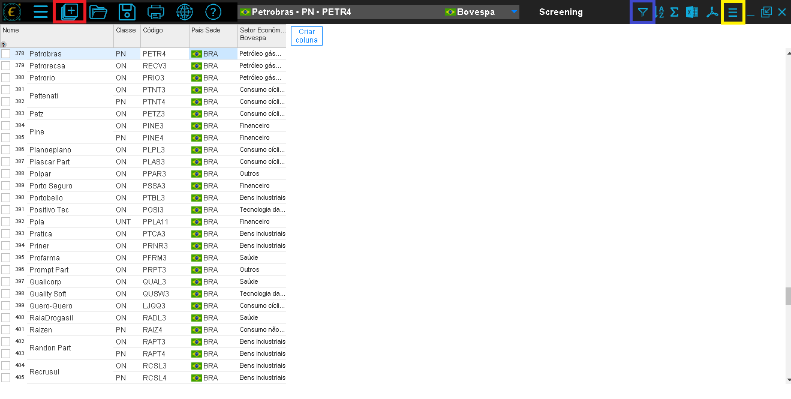

#Prefácio

sumário


# Aspectos conceituais introdutórios do Economatica

## O que é Economatica?

A Economatica é uma plataforma de análise financeira focada em mercados de capitais, amplamente utilizada por investidores, analistas e profissionais de finanças. Fundada em 1986, a plataforma oferece ferramentas para a avaliação de **ações**, **índices econômicos** e **empresas**, permitindo a análise de dados históricos e projeções. 
Com presença em vários países da América Latina, incluindo Brasil, Argentina e México, a Economática é reconhecida pela precisão e abrangência de suas informações financeiras. A plataforma é uma referência importante para decisões de investimento e análise econômica.

## Acesso ao Economatica

Para acessar o Economatica, primeiramente entramos no endereço https://economatica.com. No canto superior direito, apertamos no botão **Login**, e em seguida basta clicar na **segunda opção** abaixo:	

```{r echo=FALSE}
knitr::include_graphics("acessoA.png")
```

Após isso, a tela de login aparecerá, e basta inserir seu **e-mail institucional** e entrar no Economatica. É importante ressaltar que o Economatica é uma plataforma paga, e o acesso com o e-mail institucional é possível apenas dentro do domínio da UFERSA.

```{r echo=FALSE}

```

## Principais Funcionalidades

O Economatica possui diversas funcionalidades para auxliar o usuário a obter os dados que precisa em suas análises. 

### Ferramentas de análise

As ferramentas de análise são as janelas que, usando a base de dados e os indicadores, permitem ao usuário efetivamente manipular os dados e chegar a conclusões. Estas são as janelas que mais agregam valor ao sistema Economática e que devem ser mais intensamente exploradas pelos usuários.
Dentre elas, as que iremos utilizar mais serão as ferramentas de `Screening` e `Matrixx`

```{r echo=FALSE}
knitr::include_graphics("ferramentasanalise.png")
```

#### Screening

O screening serve para comparar dados de diferentes ativos, sendo possível escolher quais informações queremos sobre determinado grupo de ativos, como por exemplo, seus dados cadastrais, demonstrativos financeiros e indicadores.

No screening, é possível adicionar filtros para determinar apenas os ativos desejados em nossa pesquisa e organizá-los de acordo com o filtro escolhido.

#### Matrix

O Matrixx no Economatica é uma ferramenta que permite aos usuários criar matrizes personalizadas para analisar e comparar indicadores financeiros de diversas empresas ou ativos simultaneamente. Ele serve para facilitar a visualização e comparação de múltiplos dados em uma única tabela, permitindo uma análise mais eficiente de desempenho, avaliação de múltiplos, e identificação de tendências entre diferentes empresas ou setores. 

No Matrixx, é possível utilizar os dados obtidos no screening e fazer uma evolução temporal dos ativos, após escolher as variáveis de comparação desejadas, é possível definir também os parâmetros, como a data inicial e final da análise, a periodicidade e a moeda.

É especialmente útil para investidores e analistas que precisam comparar grandes volumes de informações de forma rápida e organizada.

### Indicadores

As janelas Indicadores financeiros e Indicadores de mercado mostram valores obtidos a partir de cálculos efetuados com itens da base de dados.

```{r echo=FALSE}
knitr::include_graphics("indicadores.png")
```

### Base de dados

São as janelas que apresentam cada uma das informações que compõem a base de dados do sistema. A aba de base de dados apresenta apenas os dados de um ativo em específico, o chamado ativo corrente.

```{r echo=FALSE}

```

# Etapa 1 - Selecionando a Amostra

Para melhor demonstração das funcionalidades de Screenig e Matrixx, utilizaremos um caso prático: vamos criar uma amostra com as ações da Bovespa, com exceção das financeiras, em um período de análise de 2010 à 2023, onde obteremos seu Ativo Total e seu Patrimônio Líquido (PL). 
Para isso, após selecionarmos a opção de **Screening**, teremos a seguinte tela:

```{r echo=FALSE}
knitr::include_graphics("screeningA.png")
```

```{r echo=FALSE}
knitr::include_graphics("screeningB.png")
```

Após clicar em **Abrir**, definiremos os parâmetros da amostra desejada.

```{r echo=FALSE}
knitr::include_graphics("definirparamA.png")
```

# Etapa 2 - Aplicação de Filtros para Seleção de Empresas e Setores

É possível realizar a aplicação de filtros na amostra, onde obteremos apenas os dados desejados e apenas das empresas que são necessárias para a análise.

```{r echo=FALSE}

```

```{r echo=FALSE}
knitr::include_graphics("filtrosB.png")
```

Para maior facilidade da análise, é recomendado marcar a opção **mostrar apenas uma classe por empresa**, onde teremos apenas um tipo de ação para cada entidade.

# Etapa 3 - Seleção de Variáveis

Após a aplicação dos filtros, veremos o `screening`, similar ao apresentado abaixo:

```{r echo=FALSE}

```

Depois disso, podemos prosseguir para a elaboração do `Matrixx`, que pode ser feito de duas maneiras: na primeira, escolheremos item do Matrixx pelo ativo corrente. Para tal, definiremos os parâmetros desejados. No caso em questão, queremos o Ativo Total e o PL das entidades.

```{r echo=FALSE}

```

```{r echo=FALSE}
knitr::include_graphics("definirparamativo.png")
```

Depois da definição dos parâmetros iniciais, escolheremos a opção **Vários Parâmetros**, onde definiremos o horizonte temporal da amostra, desde sua periodicidade, data de início e fim da coleta, além da moeda desejada para a análise, no nosso caso, o Real.

```{r echo=FALSE}
knitr::include_graphics("export.png")
```

Cabe ressaltar que também é possível aplicar filtros baseados em colunas específicas, conforme mostrado abaixo:

```{r echo=FALSE}
knitr::include_graphics("inserirfiltro.png")
```

Aqui vemos a tela de **Vários Parâmetros**:

```{r echo=FALSE}
knitr::include_graphics("parametros.png")
```

# Etapa 4 - Coleta dos dados e estruturação de dados em painel

Concluídas todas as definições de parâmetros, teremos nosso Matrixx, onde é possível dividir a tela com o Screening, e ao selecionar a empresa no screening, seus dados serão apresentados no Matrixx.
(explicar melhor como chegar na tela dividida).

```{r echo=FALSE}
knitr::include_graphics("teladividida.png")
```

Mas há também outro modo de criar o Matrixx, utilizando todos os dados presentes no Screening, através das opções abaixo: marcando a opção **mostrar itens do Screening** e transferindo os dados para dentro do Matrixx.

```{r echo=FALSE}
knitr::include_graphics("definirparamativo.png")
```

```{r echo=FALSE}

```

```{r echo=FALSE}

```

Ao final teremos uma tela similar à mostrada a seguir:

```{r echo=FALSE}

```

Nas colunas temos o tipo de dado requerido e as empresas selecionadas, e nas linhas os anos de análise.

# Etapa 5 - Exportação de Dados

No Economatica, é possível realizar a exportação dos dados coletados para outras ferramentas de análise, possibilitando uma análise mais aprofundadada. Vários formatos são suportados, mas os mais utilizados são em CSV e XLSX.

```{r echo=FALSE}
knitr::include_graphics("export.png")
```


